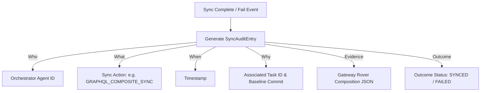

# Synchronization Audit Model — Stayflexi Platform

This document describes the logging structure, metadata properties, and Cypher registration queries used to audit all graph, memory, and gateway synchronization transactions.

---

## 1. Synchronization Audit Schema

The synchronization engine writes a detailed record to verify the completion gate.



### Ingestion Properties

- `id: String` (Unique UUID)
- `agentId: String` (AI orchestrator instance ID)
- `actionType: String` (e.g., `NEO4J_SYNC`, `GRAPHITI_SYNC`, `GRAPHQL_SYNC`)
- `timestamp: DateTime`
- `taskId: String` (Linked task ID)
- `evidence`:
  - `deltaSummary: String` (Counts of added/modified/removed relationships)
  - `compositionResult: String` (Gateway build validation codes)
- `outcome: String` (SYNCED, FAILED)

---

## 2. Cypher Ingestion Query

Every synchronization audit log is written into the Neo4j Graph to maintain historical trace records of knowledge updates.

```cypher
MATCH (t:PlaywrightTest {fileName: $testFile})
CREATE (sa:SyncAudit {
  id: apoc.create.uuid(),
  agentId: $agentId,
  actionType: $actionType,
  timestamp: datetime(),
  taskId: $taskId,
  deltaSummary: $deltaSummary,
  compositionResult: $compositionResult,
  outcome: $outcome
})
CREATE (t)-[:COMPLETED_BY_SYNC]->(sa);
```

### Querying Sync History

To trace synchronization performance over time:

```cypher
MATCH (sa:SyncAudit)
RETURN
  sa.timestamp AS Date,
  sa.actionType AS Type,
  sa.taskId AS Task,
  sa.deltaSummary AS Diff,
  sa.outcome AS Status
ORDER BY sa.timestamp DESC
LIMIT 50;
```
