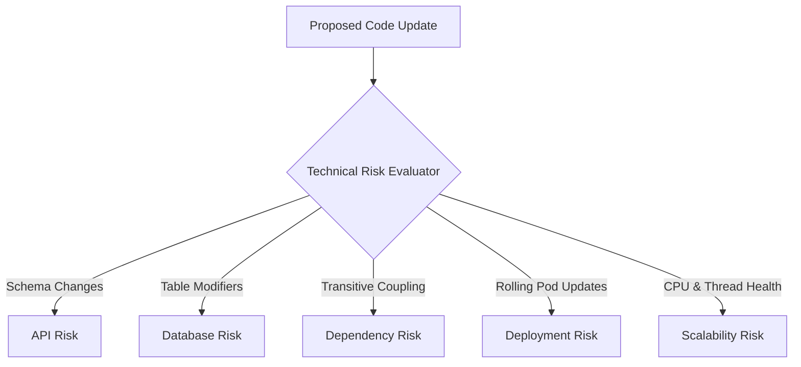

# Technical Risk Model — Stayflexi Platform

This document describes the technical risk assessment criteria, scoring matrices, and validation tests used to identify API, Database, Dependency, Deployment, and Scalability errors.

---

## 1. Technical Risk Domains

We evaluate five specific technical areas to prevent code additions from introducing compiling, scaling, or operational failures.

---

## 2. Risk Matrix & Evaluation Criteria

### 1. API Risk

- **Focus**: Web API endpoint contracts, Zod validators, and Apollo Federated gateway queries.
- **Evaluation Criteria**:
  - **HIGH RISK (Score: 8.0-10.0)**: Dropping schema fields, modifying REST method types (e.g. POST to PUT), or changing status signatures.
  - **LOW RISK (Score: 1.0-3.0)**: Adding optional parameters with default constraints.
- **Reference**: [packages/shared-validation/](file:///C:/Stayflexi/packages/).

### 2. Database Risk

- **Focus**: Prisma files alterations and database migration scripts.
- **Evaluation Criteria**:
  - **HIGH RISK (Score: 9.0-10.0)**: Renaming tables, changing keys, or adding non-nullable columns.
  - **LOW RISK (Score: 1.0-4.0)**: Adding nullable attributes or creating new tables.
- **Reference**: [booking.prisma](file:///C:/Stayflexi/src/database/prisma/schema/booking.prisma).

### 3. Dependency Risk

- **Focus**: Coupling across services and internal packages.
- **Evaluation Criteria**:
  - **HIGH RISK (Score: 7.0-9.0)**: Upgrading versions of shared utility packages without updating child package service modules.
  - **LOW RISK (Score: 1.0-3.0)**: Updating devDependencies like linters or test frameworks.

### 4. Deployment Risk

- **Focus**: Kubernetes namespace deployments and environmental variables.
- **Evaluation Criteria**:
  - **HIGH RISK (Score: 8.0-10.0)**: Introducing mandatory `.env` configurations that lack fallbacks or secrets.
  - **LOW RISK (Score: 1.0-2.0)**: Normal code updates inside isolated, stateless controllers.

### 5. Scalability Risk

- **Focus**: Connection pool allocations, CPU loops, and memory usage.
- **Evaluation Criteria**:
  - **HIGH RISK (Score: 8.0-10.0)**: Performing database operations inside nested iteration structures (`O(N^2)`) without batching or indexing.
  - **LOW RISK (Score: 1.0-3.0)**: Simple reads using existing indices.
