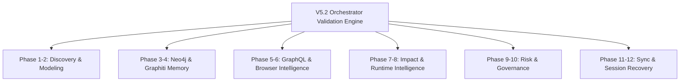

# V5.2 Final Orchestrator Validation Model — Stayflexi Platform

This document describes the certification checks, testing metrics, and validation gates required to approve the V5.2 Unified Autonomous Software Intelligence Orchestrator.

---

## 1. Multi-Phase Verification Gates

We establish eleven validation checkpoints mapping directly to the orchestrator's implementation phases.

---

## 2. Verification Specifications by Phase

### 1. Discovery & Modeling (Phases 1-2)

- **Check**: Verify the accuracy of [FEATURE_REGISTRY.md](file:///C:/Stayflexi/docs/discovery/FEATURE_REGISTRY.md) and [DOMAIN_REGISTRY.md](file:///C:/Stayflexi/docs/discovery/DOMAIN_REGISTRY.md).
- **Metric**: 100% of microservice directories must resolve to active catalog items.

### 2. Graph & Memory Foundation (Phases 3-4)

- **Check**: Confirm database indices are enforced. Verify that Graphiti retrieves semantic memory statements.
- **Metric**: Neo4j node counts match AST exports. Graphiti retrieval precision must be > 90%.

### 3. Access & Interface Telemetry (Phases 5-6)

- **Check**: Confirm GraphQL subgraph gateways compose successfully. Verify Playwright E2E browser tests are integrated.
- **Metric**: E2E browser screenshots successfully saved to recovery folders.
- **Reference**: [playwright.config.ts](file:///C:/Stayflexi/playwright.config.ts).

### 4. Impact & Runtime Telemetry (Phases 7-8)

- **Check**: Tracing database column dependencies up to UI panels. Intercepting Prometheus metrics.
- **Metric**: Latency anomalies must trigger corresponding P1 Incident creations.

### 5. Risk & Policy Enforcements (Phases 9-10)

- **Check**: Math risk scoring evaluation checks and pre-commit checks blocking unapproved dependencies.
- **Metric**: Unauthorized npm installations must abort commits. High-risk PRs block automated merges.
- **Reference**: [POLICY_ENFORCEMENT_MODEL.md](file:///C:/Stayflexi/docs/discovery/POLICY_ENFORCEMENT_MODEL.md).

### 6. Sync & Recovery (Phases 11-12)

- **Check**: Execution of topological updates. Loading of `current-state.md` project snapshots.
- **Metric**: Recovery time under 5 seconds. Parity audits show 100% database-to-graph consistency.
