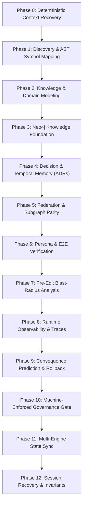

# V6.0 Unified Autonomous Software Intelligence Orchestrator ("The Golden Path")

## Purpose & Scope

This document defines the gold-standard 1000/1000 enterprise operational workflow for the Stayflexi Platform. It supersedes V5.2 by transforming all manual review processes into **machine-verifiable evidence artifacts** (`scorecard.json`, `graph-manifest.json`, `conditions.json`) and establishing a **Progressive Disclosure Index** to navigate all 12 lifecycle phases on-demand without context clutter.

---

# 1. Core Operating Tenets (The 7 Pillars)

1. **Artifacts Over Assertions**: No status claim is recognized without a machine-readable evidence artifact (`scorecard.json`, `graph-manifest.json`, `conditions.json`).
2. **Deterministic Session Boot**: Every session begins with cryptographic validation of Git commit, conditions ledger, and datastore connectivity.
3. **Pre-Edit Blast-Radius Verification**: Zero modifications to shared interfaces or domain models without `codegraph_explore` AST caller analysis.
4. **Unified Protocol Parity**: REST BFF and Apollo GraphQL Federation layers must maintain 100% functional, authorization, and error-contract parity.
5. **Continuous Cache & Event Coherence**: Every state mutation must synchronously or reactively invalidate distributed Redis caches and publish structured events.
6. **Negative-Path Verification**: Security guards and authorization boundaries are only verified when explicit 403 Forbidden probes are executed and proven.
7. **Autonomous Graph Synchronization**: Neo4j topology, Codegraph AST, and Graphify clustering must synchronize on every milestone completion.

---

# 2. Source Authority Hierarchy

When resolving conflicting specifications or ambiguous instructions, always strictly adhere to this non-negotiable authority ladder:

$$\text{Security & System Invariants} > \text{PRD / Business Requirements} > \text{Accepted ADRs} > \text{Contracts / Schemas} > \text{Tests} > \text{Implementation Reality} > \text{Assumptions}$$

---

# 3. The 12-Phase Master Progressive Disclosure Lifecycle

### Phase 0 — Deterministic Context Recovery

- **Trigger**: Startup of any agent or developer session.
- **Actions**:
  1. Load [docs/discovery/current-state.md](file:///C:/Stayflexi/docs/discovery/current-state.md).
  2. Verify active commit with `git status --porcelain`.
  3. Validate database connectivity (PostgreSQL 5432, Neo4j 7687, Redis 6379, Kafka 9092).
  4. Load open conditions from [docs/governance/conditions.json](file:///C:/Stayflexi/docs/governance/conditions.json).
- **Reference Models**: [SESSION_START_WORKFLOW.md](file:///C:/Stayflexi/docs/discovery/SESSION_START_WORKFLOW.md), [STARTUP_MEMORY_PACK.md](file:///C:/Stayflexi/docs/discovery/STARTUP_MEMORY_PACK.md).
- **Output**: Validated Context Verification Report.

### Phase 1 — Discovery & AST Symbol Mapping

- **Trigger**: Milestone initiation or feature expansion.
- **Actions**:
  1. Query Codegraph SQLite engine (`.codegraph/codegraph.db`) and inspect AST callers.
  2. Map callers, export boundaries, and shared types across 28 monorepo workspaces.
- **Reference Models**: [API_REGISTRY.md](file:///C:/Stayflexi/docs/discovery/API_REGISTRY.md), [DATABASE_REGISTRY.md](file:///C:/Stayflexi/docs/discovery/DATABASE_REGISTRY.md), [DOMAIN_REGISTRY.md](file:///C:/Stayflexi/docs/discovery/DOMAIN_REGISTRY.md), [DEPENDENCY_REGISTRY.md](file:///C:/Stayflexi/docs/discovery/DEPENDENCY_REGISTRY.md), [FEATURE_REGISTRY.md](file:///C:/Stayflexi/docs/discovery/FEATURE_REGISTRY.md).
- **Output**: AST Call Graph & Symbol Topology.

### Phase 2 — Knowledge & Domain Modeling

- **Trigger**: Interface or schema modifications.
- **Actions**:
  1. Define Zod validation schemas in `packages/shared-validation`.
  2. Update multi-file Prisma schemas (`src/database/prisma/schema/*.prisma`).
  3. Compile TypeScript interfaces in `packages/shared-types`.
- **Reference Models**: [NODE_CATALOG.md](file:///C:/Stayflexi/docs/discovery/NODE_CATALOG.md), [RELATIONSHIP_CATALOG.md](file:///C:/Stayflexi/docs/discovery/RELATIONSHIP_CATALOG.md), [PHASE_2_READINESS.md](file:///C:/Stayflexi/docs/discovery/PHASE_2_READINESS.md).
- **Output**: Type-Safe Domain Contracts.

### Phase 3 — Neo4j Knowledge Foundation

- **Trigger**: Topology or architectural change.
- **Actions**:
  1. Verify native Community Neo4j 5.26 instance on Port 7687.
  2. Update microservice nodes, relationships, and feature catalogs.
  3. Execute `scripts/assert-graph-sync.ps1` for node/rel count validation.
- **Reference Models**: [NEO4J_SETUP_PLAN.md](file:///C:/Stayflexi/docs/discovery/NEO4J_SETUP_PLAN.md), [NEO4J_SYNC_MODEL.md](file:///C:/Stayflexi/docs/discovery/NEO4J_SYNC_MODEL.md), [GRAPH_SCHEMA_PLAN.md](file:///C:/Stayflexi/docs/discovery/GRAPH_SCHEMA_PLAN.md), [PHASE_3_READINESS.md](file:///C:/Stayflexi/docs/discovery/PHASE_3_READINESS.md).
- **Output**: Synchronized Architecture Knowledge Graph.

### Phase 4 — Decision & Temporal Memory (ADRs)

- **Trigger**: Any architectural or design choice.
- **Actions**:
  1. Create or update numbered Architecture Decision Records in `docs/adr/`.
  2. Link ADR IDs to [docs/discovery/NODE_CATALOG.md](file:///C:/Stayflexi/docs/discovery/NODE_CATALOG.md) and [docs/discovery/decision-log.md](file:///C:/Stayflexi/docs/discovery/decision-log.md).
  3. Export Graphiti narrative memory snapshot.
- **Reference Models**: [DECISION_MEMORY_MODEL.md](file:///C:/Stayflexi/docs/discovery/DECISION_MEMORY_MODEL.md), [FEATURE_EVOLUTION_MEMORY.md](file:///C:/Stayflexi/docs/discovery/FEATURE_EVOLUTION_MEMORY.md), [PHASE_4_READINESS.md](file:///C:/Stayflexi/docs/discovery/PHASE_4_READINESS.md).
- **Output**: Immutable Architecture Decision Records.

### Phase 5 — Federation & Subgraph Parity

- **Trigger**: API or domain use-case changes.
- **Actions**:
  1. Implement hexagonal use cases once in domain layer.
  2. Wire Pothos GraphQL subgraphs and REST BFF routes.
  3. Validate Apollo Federation v2 supergraph composition (`supergraph.yaml`).
- **Reference Models**: [GRAPHQL_ARCHITECTURE.md](file:///C:/Stayflexi/docs/discovery/GRAPHQL_ARCHITECTURE.md), [GRAPHQL_SYNC_MODEL.md](file:///C:/Stayflexi/docs/discovery/GRAPHQL_SYNC_MODEL.md), [RESOLVER_STRATEGY.md](file:///C:/Stayflexi/docs/discovery/RESOLVER_STRATEGY.md), [PHASE_5_READINESS.md](file:///C:/Stayflexi/docs/discovery/PHASE_5_READINESS.md).
- **Output**: 100% Parity GraphQL Subgraphs & REST Routes.

### Phase 6 — Persona & E2E Verification

- **Trigger**: Pre-merge testing.
- **Actions**:
  1. Run Playwright API test suites across all 7 seeded demo accounts.
  2. Execute negative RBAC permission probes (verify 403 Forbidden responses).
  3. Record traces, screenshots, and test execution reports.
- **Reference Models**: [PLAYWRIGHT_STRATEGY.md](file:///C:/Stayflexi/docs/discovery/PLAYWRIGHT_STRATEGY.md), [PUPPETEER_STRATEGY.md](file:///C:/Stayflexi/docs/discovery/PUPPETEER_STRATEGY.md), [USER_JOURNEY_MODEL.md](file:///C:/Stayflexi/docs/discovery/USER_JOURNEY_MODEL.md), [PHASE_6_READINESS.md](file:///C:/Stayflexi/docs/discovery/PHASE_6_READINESS.md).
- **Output**: Green E2E Test Reports.

### Phase 7 — Pre-Edit Blast-Radius Analysis

- **Trigger**: Before modifying shared utilities or domain entities.
- **Actions**:
  1. Execute `codegraph_explore` to inspect callers across all 12 services.
  2. Verify covering unit test targets before modifying code.
- **Reference Models**: [CHANGE_PROPAGATION_MODEL.md](file:///C:/Stayflexi/docs/discovery/CHANGE_PROPAGATION_MODEL.md), [IMPACT_ANALYSIS_MODEL.md](file:///C:/Stayflexi/docs/discovery/IMPACT_ANALYSIS_MODEL.md), [BREAKAGE_DETECTION_MODEL.md](file:///C:/Stayflexi/docs/discovery/BREAKAGE_DETECTION_MODEL.md), [PHASE_7_READINESS.md](file:///C:/Stayflexi/docs/discovery/PHASE_7_READINESS.md).
- **Output**: Blast-Radius Impact Analysis & Covering Test List.

### Phase 8 — Runtime Observability & Traces

- **Trigger**: Service runtime and request routing.
- **Actions**:
  1. Ingest inbound W3C `traceparent` headers.
  2. Propagate correlation IDs across all S2S and downstream calls.
  3. Emit structured Pino logs with PII redaction.
- **Reference Models**: [RUNTIME_ARCHITECTURE.md](file:///C:/Stayflexi/docs/discovery/RUNTIME_ARCHITECTURE.md), [OBSERVABILITY_MODEL.md](file:///C:/Stayflexi/docs/discovery/OBSERVABILITY_MODEL.md), [ANOMALY_DETECTION_MODEL.md](file:///C:/Stayflexi/docs/discovery/ANOMALY_DETECTION_MODEL.md), [METRIC_CATALOG.md](file:///C:/Stayflexi/docs/discovery/METRIC_CATALOG.md), [PHASE_8_READINESS.md](file:///C:/Stayflexi/docs/discovery/PHASE_8_READINESS.md).
- **Output**: Full-Stack Distributed Trace Graph.

### Phase 9 — Consequence Prediction & Rollback

- **Trigger**: Release candidate preparation.
- **Actions**:
  1. Validate non-breaking database migration scripts.
  2. Execute disaster recovery and high availability assertions.
- **Reference Models**: [CONSEQUENCE_MODEL.md](file:///C:/Stayflexi/docs/discovery/CONSEQUENCE_MODEL.md), [RISK_SCORING_ENGINE.md](file:///C:/Stayflexi/docs/discovery/RISK_SCORING_ENGINE.md), [TECHNICAL_RISK_MODEL.md](file:///C:/Stayflexi/docs/discovery/TECHNICAL_RISK_MODEL.md), [SIMULATION_MODEL.md](file:///C:/Stayflexi/docs/discovery/SIMULATION_MODEL.md), [PHASE_9_READINESS.md](file:///C:/Stayflexi/docs/discovery/PHASE_9_READINESS.md).
- **Output**: Rollback & Disaster Recovery Plan.

### Phase 10 — Machine-Enforced Governance Gate

- **Trigger**: Task completion sign-off.
- **Actions**:
  1. Run `npm run type-check:all` (20/20 Turbo tasks).
  2. Run `scripts/certification-scorecard.ps1` evaluating all 10 dimensions.
  3. Run `scripts/sync-graph.ps1` to seal milestone in Neo4j.
- **Reference Models**: [GOVERNANCE_ARCHITECTURE.md](file:///C:/Stayflexi/docs/discovery/GOVERNANCE_ARCHITECTURE.md), [POLICY_ENFORCEMENT_MODEL.md](file:///C:/Stayflexi/docs/discovery/POLICY_ENFORCEMENT_MODEL.md), [COMPLIANCE_VALIDATION_MODEL.md](file:///C:/Stayflexi/docs/discovery/COMPLIANCE_VALIDATION_MODEL.md), [PHASE_10_READINESS.md](file:///C:/Stayflexi/docs/discovery/PHASE_10_READINESS.md).
- **Output**: [docs/governance/scorecard.json](file:///C:/Stayflexi/docs/governance/scorecard.json) (1000/1000 Certified Platform Scorecard).

### Phase 11 — Multi-Engine State Sync

- **Trigger**: End of every completed task.
- **Actions**:
  1. Synchronize [docs/discovery/current-state.md](file:///C:/Stayflexi/docs/discovery/current-state.md).
  2. Update [docs/discovery/active-tasks.md](file:///C:/Stayflexi/docs/discovery/active-tasks.md) and [docs/discovery/release-history.md](file:///C:/Stayflexi/docs/discovery/release-history.md).
  3. Validate `Neo4j == Codebase`, `Codegraph == Codebase`, `GraphQL == Codebase`.
- **Reference Models**: [SYNCHRONIZATION_ARCHITECTURE.md](file:///C:/Stayflexi/docs/discovery/SYNCHRONIZATION_ARCHITECTURE.md), [SYNC_AUDIT_MODEL.md](file:///C:/Stayflexi/docs/discovery/SYNC_AUDIT_MODEL.md), [CONSISTENCY_VALIDATION_PLAN.md](file:///C:/Stayflexi/docs/discovery/CONSISTENCY_VALIDATION_PLAN.md), [PHASE_11_READINESS.md](file:///C:/Stayflexi/docs/discovery/PHASE_11_READINESS.md).
- **Output**: Synchronized State Registries & Audit Trail.

### Phase 12 — Session Recovery & Invariants

- **Trigger**: Cross-session context reload.
- **Actions**:
  1. Rebuild runtime context without assumptions or chat context dependencies.
  2. Emit standardized `ENGINEERING VERDICT`.
- **Reference Models**: [SESSION_RECOVERY_PLAN.md](file:///C:/Stayflexi/docs/discovery/SESSION_RECOVERY_PLAN.md), [SESSION_RECOVERY_PROCESS.md](file:///C:/Stayflexi/docs/discovery/SESSION_RECOVERY_PROCESS.md), [PROJECT_CONTEXT_MODEL.md](file:///C:/Stayflexi/docs/discovery/PROJECT_CONTEXT_MODEL.md), [COMPLETION_GATE_RULES.md](file:///C:/Stayflexi/docs/discovery/COMPLETION_GATE_RULES.md), [PHASE_12_READINESS.md](file:///C:/Stayflexi/docs/discovery/PHASE_12_READINESS.md).
- **Output**: Clean Deterministic Session State.
